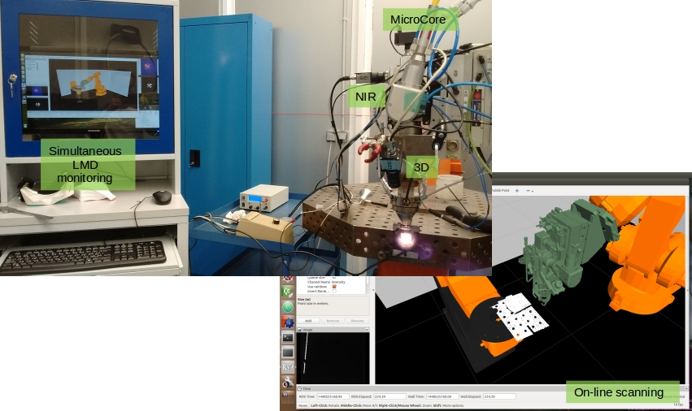

# MAShES

Multimodal spectrAl control of laSer processing with cognitivE abilities.

## Introduction

Laser Metal Deposition (LMD) is a promising technique used for direct
manufacturing of metallic parts. This near-net-shape (close to the final
geometry) technique builds up a part with a coarse geometry (to improve the
production rate) through the successive deposition of molten tracks
layer-by-layer. This means, metallic parts are built up layer-by-layer
overlapping successive laser cladding tracks. A final machining is required
to achieve the required dimensions and surface finish.

This novel manufacturing technique allows manufacturing pieces without
limitation of size and minimizing material waste. The difficulty to ensure the
final properties of the part (e.g. mechanical properties, dimensions), many of
them related to deformations caused by the heat input of the laser beam, and
the difficulty of programming the necessary paths to manufacture layer-by-layer
the piece are main limitations of this technique.

In this sense, it is necessary to develop new systems able to guarantee the
quality and accuracy of parts, without decreasing productivity. MAShES is
developing a full multimodal solution able to overcome these limitations
through a full monitoring and control solution for LMD. This solution is going
to detect and correct defects and distortions to guarantee the part quality.

## Contents

Current solution presents two coaxial image sensors, a CMOS sensor from IDS and
a high-speed uncooled MWIR camera sensor from [NIT Europe](http://www.niteurope.com/),
for on-line process monitoring. Moreover an off-axis triangulation solution
based on a red laser stripe and another IDS camera is used for geometrical
monitoring.



This meta-package contains four packages:
- mashes_workcell: contains the working cell description files.
- mashes_ueye: contains the modules required for NIR coaxial monitoring.
- mashes_tachyon: contains the modules required for SWIR/MWIR coaxial monitoring.
- mashes_measures: contains modules to calculate geometrical measures from NIR
  images.

## Quick start

To play a bag file with the simultaneous recorded data:

```
rosrun rosbag play data.bag --clock
roslaunch mashes_robviz robviz.launch sim:=true
```

where data.bag is the absolute file path.

Some datasets are available on [MAShES ZENODO](https://zenodo.org/record/45664?ln=en#.V0Med57WT6I).

## Acknowledgement

This work is been supported by the European Commission through the research
project "Multimodal spectrAl control of laSer processing with cognitivE
abilities (MAShES)", H2020-FoF-2014 - Grant Agreement Nº 637081.

[http://www.mashesproject.eu/](http://www.mashesproject.eu/)
